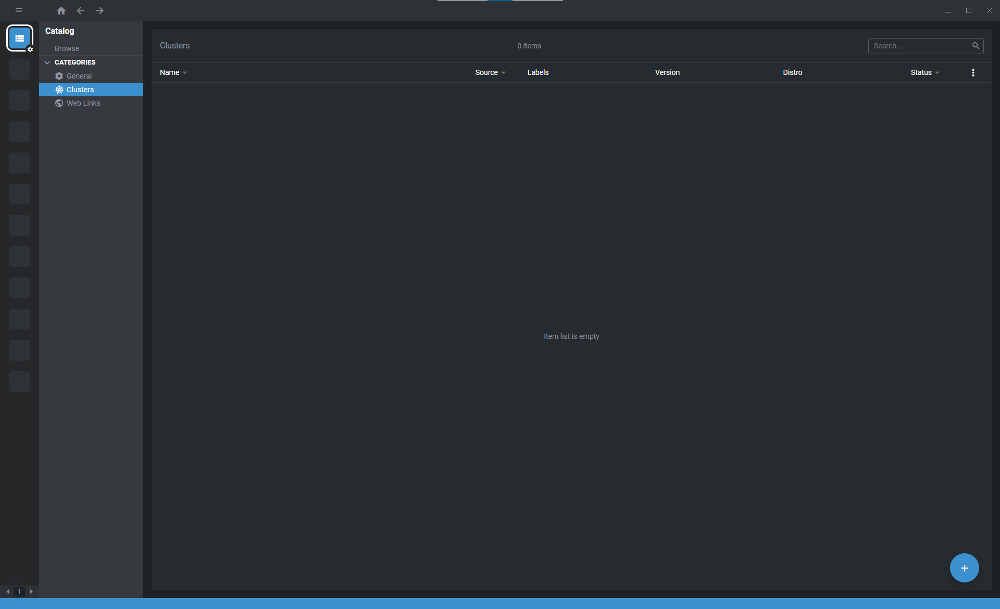

OpenLens
========

`OpenLens <https://github.com/lensapp/lens>`__ is the open source version of `Lens IDE <https://k8slens.dev/>`__, an integrated development environment for Kubernetes.

   Screenshot of OpenLens.

Installation
------------

Binaries for OpenLens are available at https://github.com/MuhammedKalkan/OpenLens.

Extensions
^^^^^^^^^^

Some useful extensions:

-  `node and pod menu
   functionality <https://github.com/alebcay/openlens-node-pod-menu>`__

Adding New Cluster
==================

1. Copy the file ``/etc/rancher/k3s/k3s.yaml`` from the remote cluster to your machine.
2. Replace ::

      apiVersion: v1
      clusters:
      - cluster:
            server: https://127.0.0.1:6443

   with ::

      apiVersion: v1
      clusters:
      - cluster:
            server: https://78.46.233.119

3. On OpenLens, click on ``File > Add Cluster``.

   .. figure:: ./img/openlens-add-cluster.png
      :alt: Screenshot of OpenLens showing text field to add new cluster.

      Screenshot of OpenLens showing text field to add new cluster.

4. Paste editted copy of ``/etc/rancher/k3s/k3s.yaml`` in the text field and click on ``Add cluster``.

   .. figure:: ./img/openlens-new-cluster.png
      :alt: Screenshot of OpenLens listing all clusters.

      Screenshot of OpenLens listing all clusters.

5. After the cluster be successfully added, click on the cluster to open the dashboard.

   .. figure:: ./img/openlens-cluster-dashboard.png
      :alt: Screenshot of OpenLens showing cluster dashboard.

      Screenshot of OpenLens showing cluster dashboard.
